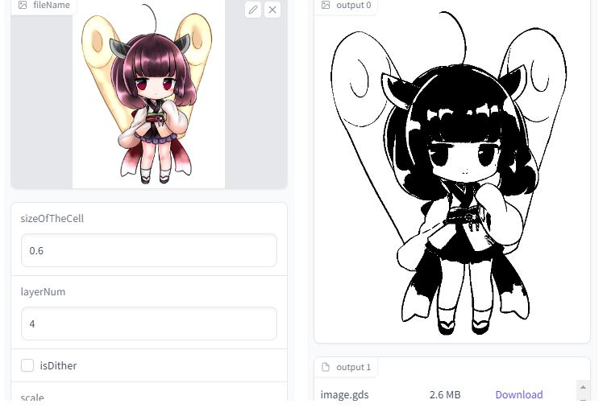
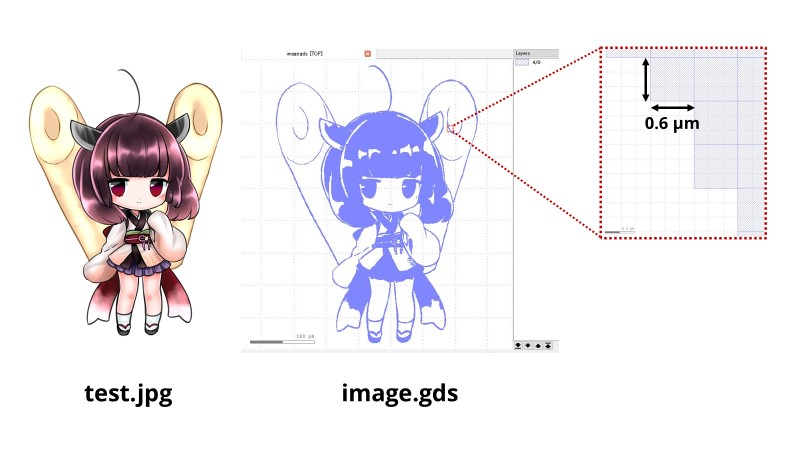
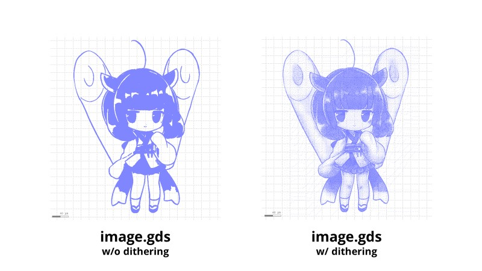

# Picture to GDS
Python script to convert image files to GDSII files

## Getting Started
This is a simple script for generating GDSII layout files from image files. The extension of the input file should be jpeg, jpg, png, pbm, pgm, or bmp. By specifying an input image file path, size of unit-cells (minimum width and space), and layer number of an output GDSII file, you can get a binary image file (image.bmp) and a GDSII layout file (image.gds).

### Demo
[](http://colab.research.google.com/github/ourfool/picture-to-gds/blob/master/demo.ipynb)



### Prerequisites
- NumPy
- openCV
- gdspy


## Usage
```
$ python picToGDS.py [-h] [--scale SCALE] [-d] fileName sizeOfTheCell layerNum
```

## Example
```
$ python picToGDS.py test.jpg 0.6 4
```


```
# Floyd–Steinberg dithering
$ python picToGDS.py -d test.jpg 0.6 4
```


```
# Scaling
$ python picToGDS.py --scale 2.0 -d test.png 1.0 2
```


## License
This project is licensed under the GPLv3 License - see the [LICENSE](LICENSE) file for details
